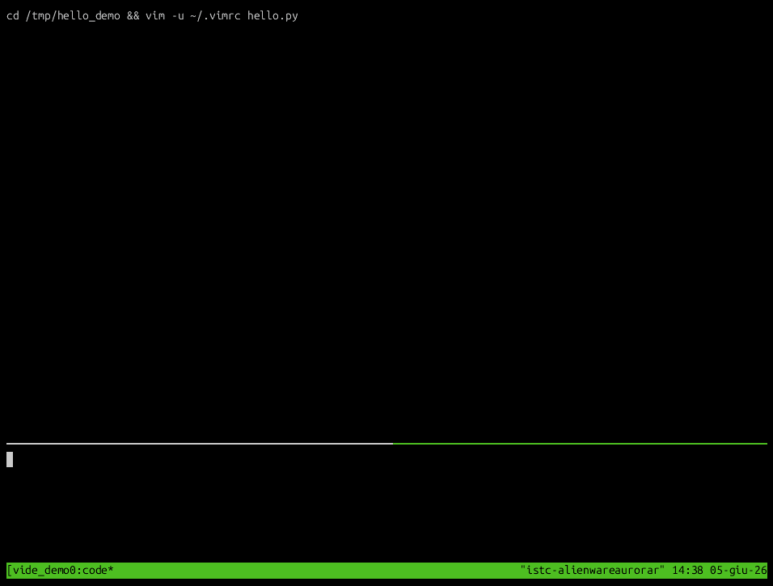

# Yet Another VimIDE

A lightweight Python IDE built on Vim and tmux. VimIDE turns Vim into a multi-panel development environment with integrated IPython, AI assistance, LaTeX support, and a terminal console — all inside a persistent tmux session.

**Documentation**: https://francesco-mannella.github.io/vimide/



---

## Table of Contents

- [Overview](#overview)
- [Layout](#layout)
- [Installation](#installation)
- [The `vide` Launcher](#the-vide-launcher)
- [tmux Configuration](#tmux-configuration)
- [IDE Shortcuts](#ide-shortcuts)
- [Python Features](#python-features)
  - [IPython Integration](#ipython-integration)
  - [Code Cells](#code-cells)
  - [Linting and Fixing (ALE)](#linting-and-fixing-ale)
  - [Jupyter Notebook Support](#jupyter-notebook-support)
- [LaTeX Features](#latex-features)
- [AI Integration](#ai-integration)
- [General Editor Features](#general-editor-features)
- [Color Schemes](#color-schemes)
- [Installed Plugins](#installed-plugins)
- [Repository Structure](#repository-structure)

---

## Overview

VimIDE is a Vim plugin plus a launcher script (`vide`) that sets up a full development environment:

- **Vim** runs in the top pane of a tmux window named `code`, with a three-panel layout: tag browser, editor, file explorer.
- **IPython** runs in the bottom pane, linked to the editor via vim-slime.
- Code cells, selections, or full scripts can be sent from the editor to IPython with single keystrokes.
- ALE provides async linting (flake8 + mypy via pylsp) and auto-fixing (black, isort, autoimport).
- vim-ai provides AI text and code assistance through OpenRouter.

---

## Layout

```
--------------------------------------------------------------------
|                |                      |                          |
|    Tagbar      |      Editor          |      File Explorer       |
|                |                      |                          |
--------------------------------------------------------------------
|                    IPython console (bottom pane)                 |
--------------------------------------------------------------------
```

The Tagbar and file explorer panels collapse to minimal width when unfocused and expand on entry, keeping the editor at maximum width during editing.

Within the Tagbar:
- **Double-click** or **`<Return>`**: jump to the function/class/method definition.

---

## Installation

Before running the installer, provision the OpenRouter token:

```bash
mkdir -p ~/.config/ai
echo "sk-or-..." > ~/.config/ai/openrouter.token
chmod 600 ~/.config/ai/openrouter.token
```

Then run:

```bash
./install.sh
```

The installer:

1. Installs vim-plug if absent.
2. Backs up and replaces `~/.vimrc` with `scripts/vimrc`.
3. Backs up and replaces `~/.tmux.conf` with `scripts/tmux.conf`.
4. Installs/updates all Vim plugins via vim-plug.
5. Copies `scripts/roles.ini` to `~/.config/ai/roles.ini`.
6. Copies `scripts/CLAUDE.md` to `~/.claude/CLAUDE.md`.
7. Installs Python tools: `ipynb-py-convert`, `notedown` (via uv).
8. Installs system packages: `tmux`, `universal-ctags`.
9. Copies `scripts/vide` to `~/bin/vide` and adds `~/bin` to `PATH`.
10. Adds a `vim --servername vim` alias to `.bashrc`.
11. Adds SSH auth and DISPLAY tracking fix for tmux sessions.

---

## The `vide` Launcher

`vide` manages named tmux sessions containing the IDE. It is installed to `~/bin/vide`.

```
vide -n NAME        Start or reattach a session named NAME
vide -q NAME        Terminate the session named NAME
vide -l             List all active vide sessions
vide -d DIR         Set the working directory (default: current directory)
vide -h             Show help
```

On first launch, `vide`:

1. Creates a detached tmux session `vide_NAME` with window `code`, split into two panes: top (Vim, 75%) and bottom (console, 25%).
2. Starts Vim in the top pane, calls `RunPyIDE()` to initialize the three-panel layout, and configures vim-slime to target the bottom console pane.
3. Attaches to the session with focus on the top pane.

```
tmux session: vide_NAME
└── window: code
    ├── pane 0 (top, 75%)
    │   ┌─────────────┬───────────────────┬───────────────────┐
    │   │   Tagbar    │      Editor       │   File Explorer   │
    │   └─────────────┴───────────────────┴───────────────────┘
    └── pane 1 (bottom, 25%)
        ┌───────────────────────────────────────────────────────┐
        │                   IPython console                     │
        └───────────────────────────────────────────────────────┘
```

---

## tmux Configuration

`scripts/tmux.conf` (installed to `~/.tmux.conf`) sets:

- **Terminal**: `screen-256color` with true-color overrides for xterm-compatible terminals.
- **Prefix key**: `Ctrl-a` (replaces the default `Ctrl-b`).
- **Message display time**: 0 ms (messages dismissed immediately).
- **Mouse**: enabled.

---

## IDE Shortcuts

Provided by `plugin/vimide.vim`. Active in all buffers (normal mode).

| Key   | Action |
|-------|--------|
| `,cp` | Open or reset the IDE layout (Tagbar + Editor + File Explorer) |
| `,cf` | Find all occurrences of the word under cursor; display in editor |
| `,cg` | Jump to the file and line of the occurrence under cursor (use inside find list) |
| `,cr` | Write back edits made in the find list to their source files |
| `,cu` | Refresh the file explorer |
| `,cm` | Fetch available free models from OpenRouter and select one as default |
| `,f`  | Open the file path under cursor in the editor window |

### Find and replace workflow

1. `,cf` — searches `.py`, `.tex`, `.cpp`, `.h`, `.hpp` files under the working directory for the word under cursor. Results appear in the editor in a structured list.
2. Edit lines in the list to change text in-place.
3. `,cr` — writes the modified lines back to their source files.
4. `,cg` — jump directly to the file and line of the result under cursor.

---

## Python Features

Provided by `after/ftplugin/python.vim`. Active in Python buffers only.

### IPython Integration

Requires vim-slime configured to target the bottom console pane (done automatically by `vide`).

| Key    | Mode   | Action |
|--------|--------|--------|
| `\ss`  | normal | Start IPython (Qt backend) in the console pane |
| `\as`  | normal | Start IPython (Agg backend, non-interactive) |
| `\hh`  | normal | Send current line to IPython |
| `\hh`  | visual | Send selection to IPython |
| `\aa`  | normal | Send current line to IPython and advance cursor |
| `\aa`  | visual | Send selection to IPython and advance cursor |
| `\rr`  | normal | Run the entire script (`%run`) |
| `\RR`  | normal | Run the entire script and report execution time |
| `\dd`  | normal | Start debugger (`%run -d`) on the current script |
| `\qq`  | normal | Exit debug mode or IPython |
| `\QQ`  | normal | Restart IPython |

`\hh` and `\aa` include a guard: if IPython is not at an empty prompt (i.e., currently executing something), the send is blocked and a warning is shown. This prevents accidentally queueing input into a running computation.

### Code Cells

Cells are delimited by `# %%` or `#%%` markers (Jupyter percent format).

| Key    | Mode          | Action |
|--------|---------------|--------|
| `\cc`  | normal        | Execute the current cell |
| `\vv`  | normal        | Execute the current cell verbosely, then jump to next cell |
| `\ll`  | normal        | Clear console, execute current cell, jump to next cell |
| `\LL`  | normal        | Clear the IPython console |
| `\xx`  | normal        | Close all Matplotlib figure windows |
| `[c`   | normal        | Jump to previous cell header |
| `]c`   | normal        | Jump to next cell header |
| `F9`   | normal/insert | Insert a new cell header above, enter insert mode |
| `F10`  | normal/insert | Insert a new cell header below, enter insert mode |

### Linting and Fixing (ALE)

Active in Python buffers (buffer-local mappings).

| Key      | Action |
|----------|--------|
| `Ctrl-k` | Jump to previous lint error (wrapping) |
| `Ctrl-j` | Jump to next lint error (wrapping) |
| `Ctrl-f` | Auto-fix the file (black, isort, autoimport) |
| `Ctrl-h` | Show hover documentation at cursor |
| `Ctrl-x` | Close the ALE hover/preview window |

**Linters**: `pylsp` (flake8 backend, ignoring E203/E501/W503; mypy with dmypy) and `jedils`.

**Fixers**: `black` (line length 90), `isort`, `autoimport`.

**Note on terminal key handling**: with `screen-256color`, `Ctrl-h` and `<BS>` share the same byte (0x08). Both keys are mapped to hover to ensure the binding fires regardless of how the terminal encodes the keypress.

### Jupyter Notebook Support

Python files are treated as Jupytext percent-format notebooks (`py:percent`). Saving a `.py` file automatically updates the paired `.ipynb` via jupytext.

---

## LaTeX Features

Provided by `after/ftplugin/tex.vim` via vimtex.

- **Compiler**: `latexmk` with bibtex, synctex, shell-escape, and non-stop mode.
- **PDF viewer**: Okular with forward/inverse search via synctex.
- **Spell checking**: enabled (en_us), with a custom word list at `spell/dict.utf-8.add`.
- **`§`**: reformats indentation of selected LaTeX comment blocks.
- **ALE**: disabled per-buffer (`b:ale_enabled = 0`) to avoid interference with vimtex.
- **`F9`** (insert mode): trigger LaTeX completion.
- Quickfix suppresses: Underfull, Overfull, Font, Float, Difference warnings.
- All folds open by default (`foldlevelstart=99`).

---

## AI Integration

Provided by vim-ai with roles defined in `~/.config/ai/roles.ini`. All roles route through OpenRouter using a token at `~/.config/ai/openrouter.token`.

Use `,cm` to dynamically fetch currently available free models from OpenRouter and set one as the default.

### Model Roles

Select a specific backend by passing the role name to vim-ai commands.

| Role      | Model |
|-----------|-------|
| `default` | `openrouter/free` (dynamically resolved by OpenRouter) |
| `gemini`  | `google/gemini-3-flash-preview` |
| `gpt`     | `openai/gpt-4o` |
| `gpt5`    | `gpt-5.4` |
| `claude`  | `anthropic/claude-3.5-sonnet` |
| `opus`    | `anthropic/claude-opus-4.6` |

### Prompt Roles

Text and code transforms applied to the current selection using the default model.

| Role                | Purpose |
|---------------------|---------|
| `refine`            | Rewrite and improve text for clarity and flow |
| `translate`         | Translate text to English |
| `professional`      | Rewrite in a professional, expert tone |
| `simplify`          | Simplify language, avoid jargon |
| `clarity`           | Make text direct and unambiguous |
| `code`              | Improve and format code (79-char line limit) |
| `refactor`          | Refactor for clarity and maintainability |
| `optimize`          | Optimize for speed and memory |
| `comment`           | Add comments and docstrings |
| `enhance-docstring` | Rewrite docstrings in Google format |
| `enhance-comments`  | Add and improve inline comments and docstrings |
| `reformat-comments` | Reformat comments to fit within 79 characters |

---

## General Editor Features

### Commenting

Works across file types (Python, Bash, C/C++, TeX, Vim, etc.).

| Key  | Action |
|------|--------|
| `zc` | Comment selected lines |
| `zv` | Uncomment selected lines |

### Git Grep

| Key   | Action |
|-------|--------|
| `\g`  | Git grep whole-word for the word under cursor |
| `\t`  | Return to previous location after a grep jump |
| `:GG`  | Git grep (arbitrary pattern) |
| `:GGw` | Git grep whole-word |
| `:GGi` | Git grep case-insensitive |

### Clipboard

Requires `xclip`.

| Key  | Action |
|------|--------|
| `ay` | Yank selection to system clipboard |
| `ap` | Paste from system clipboard |

### Markdown

| Key   | Action |
|-------|--------|
| `\mm` | Add HTML anchor tags to headings in the selected range (visual mode) |

Live preview with MathJax support via vim-instant-markdown (opens in browser on save).

### Miscellaneous

| Feature | Detail |
|---------|--------|
| `:Bdi` | Close all hidden (non-visible) buffers |
| Auto-save | Saves all buffers on focus lost |
| Indent guides | Alternating dark stripes every 4 spaces |
| Mark visualization | Marks shown in sign column (vim-signature) |
| Directory diff | `:DirDiff` via vim-dirdiff |
| Line numbers | Always on |
| Search | Smart case-insensitive (`ignorecase` + `smartcase`) |
| Indentation | 4 spaces, expandtab, for all files |
| Wrap navigation | `Up`/`Down` move by display lines (`gk`/`gj`) |
| Shell slime | `\hh`/`\aa` send lines/regions to console in bash buffers too |

---

## Color Schemes

Bundled in `colors/`:

| Scheme | Description |
|--------|-------------|
| `late_evening` | Default dark scheme (active) |
| `blackdust` | Dark with subtle tones |
| `calmar256-dark` | 256-color dark |
| `calmar256-light` | 256-color light |
| `corporation` | High-contrast dark |

---

## Installed Plugins

| Plugin | Purpose |
|--------|---------|
| vim-vinegar | Enhanced netrw file explorer |
| vimtex | LaTeX editing and compilation |
| jedi-vim | Python autocompletion |
| ale | Async linting and fixing |
| tagbar | Tag/symbol browser |
| jupytext.vim | Jupyter notebook / percent-format sync |
| vim-dirdiff | Directory diff |
| vim-ipynb | Jupyter notebook support |
| vim-slime | Send code to a terminal multiplexer pane |
| vim-ipython-cell | Cell-based IPython execution |
| vim-signature | Visual mark management |
| vim-sh-heredoc-highlighting | Heredoc syntax in shell files |
| vim-ai | AI text and code assistance |
| vim-sh | Improved shell script syntax |
| traces.vim | Live preview of `:s` substitutions |
| vim-instant-markdown | Live Markdown preview in browser |
| loremipsum | Lorem ipsum generator |
| vim-indent-guides | Visual indentation guides |
| vim-markdown-toc | Table of contents for Markdown |
| gitgrep.vim | Git grep integration |

---

## Repository Structure

```
.
├── after/ftplugin/
│   ├── python.vim       # Python: IPython, ALE, cell navigation, Jupytext
│   └── tex.vim          # LaTeX: vimtex, spell, ALE disabled per-buffer
├── colors/              # Bundled color schemes
├── doc/
│   └── vimide.txt       # Vim help file
├── plugin/
│   └── vimide.vim       # Core IDE: layout, find/replace, ctags, OpenRouter
├── scripts/
│   ├── vimrc            # Vim configuration (installed to ~/.vimrc)
│   ├── tmux.conf        # tmux configuration (installed to ~/.tmux.conf)
│   ├── roles.ini        # vim-ai role definitions
│   ├── CLAUDE.md        # Claude Code project instructions
│   └── vide             # IDE launcher script (installed to ~/bin/vide)
├── spell/
│   └── dict.utf-8.add   # Custom spell-check word list
└── install.sh           # Installer
```
